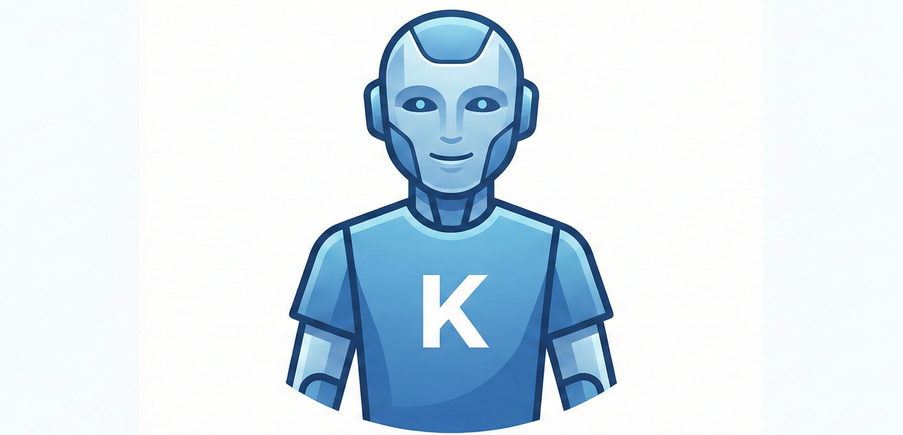

<p align="center">
  
</p>

# kagents: A lightweight agent framework for Kaggle Benchmarks.

`kagents` is a library that enables you to run powerful agents in a few lines of code, integrated with [Kaggle Benchmarks](https://github.com/Kaggle/kaggle-benchmarks). It offers:

- **Simplicity**: Initialize and run powerful agents effortlessly with just a few lines of code.
- **Code Execution**: Built-in `PythonCodeRunnerTool` allows agents to write and securely execute Python code to solve computational problems.
- **Kaggle Benchmarks Integration**: Designed to work seamlessly with `kaggle_benchmarks` (kbench) LLMs, tasks, and assertions.
- **Extensibility**: Easily equip your agents with custom Python functions or built-in tools to expand their capabilities.

## Quick demo

Here is a quick example of how to leverage `kagents` with a Python code runner:

```python
import kaggle_benchmarks as kbench
from kagents import CodeAgent, PythonCodeRunnerTool

# 1. Initialize the agent with tools and an LLM model
agent = CodeAgent(
    tools=[PythonCodeRunnerTool()],
    model=kbench.llm,
    max_steps=6,
    verbosity_level=2,
    additional_instructions=(
        "You can write and execute Python code to solve problems. "
        "Use print() inside your code snippets so the output is visible."
    )
)

# 2. Ask a question
question = (
    "What is the sum of all integers from 1 to 99 (inclusive) "
    "that are divisible by 3 or by 5? "
    "Write Python code to compute the answer."
)

# 3. Formulate the answer via the agent's Write-Execute-Observe loop
answer = agent.run(question)

print("FINAL ANSWER:", answer)
```

## How do Code agents work?

Code agents process instructions by interacting in an iterative loop fueled by a Large Language Model (LLM) and available tools (like a Python code interpreter). The chat interactions and state of the agent are securely isolated using `kbench.chats.new()` from the Kaggle Benchmarks framework. The typical lifecycle of a code agent is:

1. **Understand & Plan**: The agent receives a prompt and figures out how to solve it.
2. **Execute Tools**: Instead of predicting the final answer directly, it generates Python code or tool calls to process data, perform calculations, or interact with an environment.
3. **Observe Results**: The codebase executes the agent's code/tools in an isolated context and feeds the strict output or tracebacks directly back to the agent.
4. **Iterate**: Based on these observations, the agent repeats the loop (refining code or making new tool calls) until it confidently produces a final answer.

Leveraging actual execution instead of pure LLM generation dramatically increases accuracy and reliability, particularly for logic-heavy, analytical, or algorithmic questions.

## Cite kagents

If you find `kagents` useful in your research or benchmarks, please consider citing or acknowledging it (adapt as necessary):

```bibtex
@Misc{kagents,
  title =        {`kagents`: A lightweight agent framework for Kaggle Benchmarks.},
  author =       {Hoang-An Vo},
  howpublished = {\url{https://github.com/anpc849/kagents}},
  year =         {2026}
}
```

## Acknowledgement

Some of the codes are borrowed/refer from below repositories:
- [https://github.com/huggingface/smolagents](https://github.com/huggingface/smolagents)
