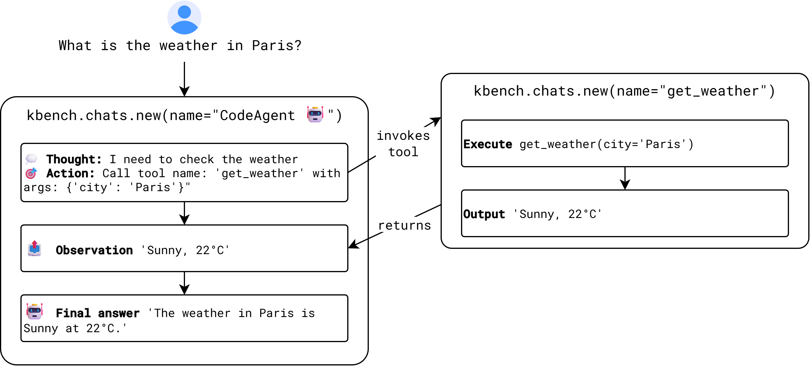

<p align="center">
  
</p>

# Kagentic: A lightweight, developer-friendly framework built on [Kaggle Benchmarks](https://github.com/Kaggle/kaggle-benchmarks), making it effortless to build, run, and benchmark powerful agents.

**If you find this project helpful and would like to support its development, consider buying me a coffee!** ☕

[](https://buymeacoffee.com/huangan)

## Features

`kagentic` provides the essential building blocks for production-ready agent automation:

* **Built-in Memory**: Automatically manages and compresses context to support long-running conversations.
* **Structured Outputs**: Ensures reliable, schema-driven interactions between agents and language models.
* **Multi-Agent Architecture**: Supports hierarchical systems where manager agents delegate work to specialized agents.
* **Extensible Tooling**: Easily integrate custom functions or external APIs.
* **Kaggle Benchmark Integration**: Runs directly with `kbench.task` and makes execution results visible in the UI.


## Quick Demo

Here is a quick example of how to leverage `kagentic` with its built-in Python Code execution runner:

```python
import kaggle_benchmarks as kbench
from kagentic import CodeAgent, PythonCodeRunnerTool

@kbench.task(name="kagentic_quick_demo")
def quick_demo_task(llm, question):
    # 1. Initialize the agent with tools and an LLM model
    agent = CodeAgent(
        tools=[PythonCodeRunnerTool()],
        model=llm,
        max_steps=6,
        verbosity_level=2,
        additional_instructions=(
            "You can write and execute Python code to solve problems. "
            "Use print() inside your code snippets so the output is visible."
        )
    )

    # 2. Formulate the answer via the agent's Write-Execute-Observe loop
    answer = agent.run(question)

    # 3. Verify the final answer using kaggle benchmark assertion
    kbench.assertions.assert_true(
        "2318" in str(answer).replace(",", "").replace(" ", ""),
        expectation=(
            "Answer should contain 2318, the sum of all integers from 1 to 99 "
            "that are divisible by 3 or 5."
        ),
    )

quick_demo_task.run(
    llm=kbench.llm,
    question=(
        "What is the sum of all integers from 1 to 99 (inclusive) "
        "that are divisible by 3 or by 5? "
        "Write Python code to compute the answer."
    ),
)
```

## Creating Custom Tools

`kagentic` makes extending an agent's functionality very easy. You can define your own Python functions as tools by subclassing `Tool` or by defining the tool schema:

```python
from kagentic.agent import CodeAgent
from kagentic.schema import ToolInput
from kagentic.tools.base import Tool
import kaggle_benchmarks as kbench

class WeatherTool(Tool):
    name = "get_weather"
    description = "Gets the current weather for a given city."
    inputs = {
        "city": ToolInput(
            type="string",
            description="The name of the city",
            required=True
        )
    }
    output_type = "string"

    def forward(self, city: str) -> str:
        # Put your custom logic or API calls here
        return f"The weather in {city} is sunny and 22°C."

agent = CodeAgent(
    tools=[WeatherTool()],
    model=kbench.llm,
)

answer = agent.run("What's the weather like in Paris?")
print(answer)
```

## How do kagentic Code Agents work?

Agents process instructions by interacting in an iterative loop fueled by a Large Language Model (LLM) and a suite of available tools. The interactions and internal state of the agent are securely isolated using `kbench.chats.new()` from the Kaggle Benchmarks framework. The core lifecycle is:


1. **Understand & Plan**: The agent receives a prompt and figures out how to decompose the problem into actionable sub-steps.
2. **Execute Tools**: Instead of predicting the final answer directly, it generates arguments for a tool, such as passing Python code to the runner to calculate numbers or pulling data from an external API.
3. **Observe Results**: The runtime executes the tool in an isolated sandbox and feeds the strict output or error tracebacks directly back to the agent.
4. **Iterate**: Based on observations, the agent repeats the loop, refining code or making subsequent tool arguments until it confidently produces a final result using the `final_answer` tool.

## Cite kagentic

If you find `kagentic` useful in your research or benchmarks, please consider citing or acknowledging it.

```bibtex
@Misc{kagentic,
  title =        {kagentic: A lightweight agent framework for Kaggle Benchmarks.},
  author =       {Hoang-An Vo},
  howpublished = {\url{https://github.com/anpc849/kagentic}},
  year =         {2026}
}
```

## Acknowledgement

Some code segments and design philosophies have been borrowed or referenced from the following repositories:
* [https://github.com/huggingface/smolagents](https://github.com/huggingface/smolagents)
* [https://github.com/langchain-ai/langchain](https://github.com/langchain-ai/langchain)
